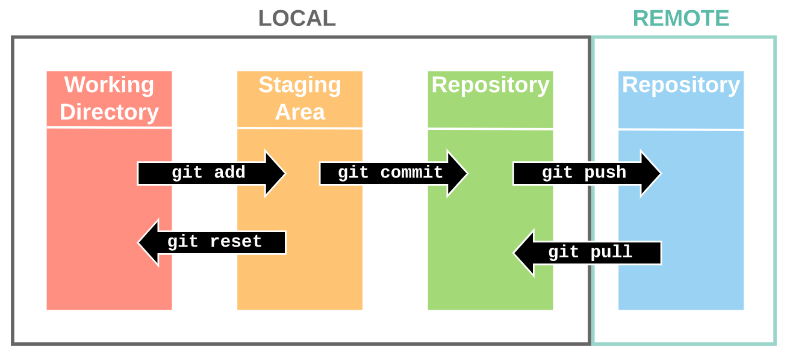

## Git 

* Git is a version control system used for tracking changes in computer files. It is generally used for source code management in software development.
* Git is used to tracking changes in the source code
* The distributed version control tool is used for source code management
* It allows multiple developers to work together
* It supports non-linear development through its thousands of parallel branches

# Features of Git

* Tracks history
* Free and open source
* Supports non-linear development
* Creates backups
* Scalable
* Supports collaboration
* Branching is easier
* Distributed development

## Stages In Git 


## The Git workflow is divided into three states:
* Working directory - Modify files in your working directory
* Staging area (Index) - Stage the files and add snapshots of them to your staging area
* Git directory (Repository) - Perform a commit that stores the snapshots permanently to your Git directory. Checkout any existing version, make changes, stage them and commit.


#### You can create a repository with either of the following commands.

* git clone ```https://github.com/ramjagadeesh6666/game-of-life	 Copies a remote repository into your current directory```

* git init	```Creates a new empty repo in your current directory```


## Commands in Git
### Create Repositories
* git init
### Make Changes
* add
* commit
* status
### Parallel Development
* branch
* merge
* rebase
### Sync Repositories
* push
* pull
* add origin


### git add <file1> <file2>	```Adds <file1> and <file2> to the staging area```

### git add *.py	 ```Adds all python files in the current directory to the staging area```

### git status	```Lists changes in working directory, and staged files```

### git commit	```Records everything in the staging area to your repository. The default text editor will prompt you for a commit message```

### git commit -m "Commit message"	```Records everything in the staging area to your repository with the commit message "Commit message"```

### git commit --amend	```Modify last commit instead of creating a new one. Useful for fixing small mistakes```

### git log	```Prints commit history of repo```

### git log "filename"	```Prints commit history of <filename>```

### git reset	```Removes all files from staging area (Opposite of git add)```

### git reset "filename"	```Removes <filename> from staging area```


## Remote 

### git fetch	``` Gets status of 'origin'. git fetch does not change your working directory or local repository (see git pull)```

### git fetch <repo> <branch>	``` Get status of <repo> <branch>```

### git pull	``` Incorporates changes from 'origin' into local repo```

### git pull <repo> <branch>	``` Incorporates changes from <repo> <branch> into local repo```

### git push	``` Incorporates changes from local repo into 'origin'```

### git push <repo> <branch> ```	Incorporates changes from local repo into <repo> <branch>```


## Branches

### git branch	```List branches```
### git branch <branch-name>	```Create new branch <branch-name```
### git checkout <branch-name>	```Switch to editing branch <branch-name>```
### git merge <branch-name> 	```Merge <branch-name> into current branch```


